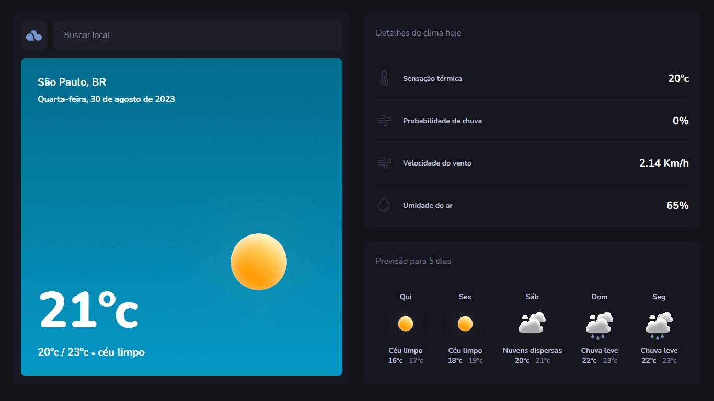

<h1 align="center" style="text-align: center;">
  
  TypeWeather
</h1>

> Aplicação para consultar dados meteorológicos e previsão do tempo.

<p align="center">
  <a href="#project">Projeto</a>&nbsp;&nbsp;&nbsp;|&nbsp;&nbsp;&nbsp;
  <a href="#technologies">Tecnologias</a>&nbsp;&nbsp;&nbsp;|&nbsp;&nbsp;&nbsp;
  <a href="#usage">Utilização</a>&nbsp;&nbsp;&nbsp;|&nbsp;&nbsp;&nbsp;
  <a href="#license">Licença</a>
</p>

<p align="center">
  
</p>

<h2 id="project">📁 Projeto</h2>

Este projeto foi desenvolvido no módulo de TypeScript do programa Explorer da Rocketseat.



<h2 id="technologies">💻 Tecnologias</h2>

Este projeto foi desenvolvido com as seguintes tecnologias:

- Axios
- Day.js
- React
- ReactDOM
- React Router Dom
- TypeScript
- Vite

<h2 id="usage">💡 Utilização</h2>

A aplicação está disponível para uso [aqui](https://type-weather.vercel.app/).

Você também pode executá-la em sua máquina localmente. Certifique-se de ter o `Node.js` e o `npm` instalados antes de prosseguir com as etapas abaixo:

1. Clone o projeto:

```
$ git clone https://github.com/madalena-rocha/type-weather
```

2. Acesse a pasta do projeto:

```
$ cd type-weather
```

3. Instale as dependências:

```
$ npm install
```

4. Inicie o servidor:

```
$ npm run dev
```

⚠️ **Importante**: Crie uma conta no site [OpenWeather](https://openweathermap.org/api) e obtenha sua chave da API. Então, crie um arquivo .env de acordo com o arquivo .env.example e preencha o campo VITE_WEATHER_APP_API com sua chave.

<h2 id="license">📝 Licença</h2>

Este projeto está sob a licença MIT.

---

Feito com 💜 by Madalena 👋🏾

<div style="display: flex;">
  <a href="https://www.linkedin.com/in/madalena-machado-rocha/" target="_blank"></a>
  <a href="mailto:rochamada1997m@gmail.com"></a>
  <a href="http://discordapp.com/users/827312692905377802" target="_blank"></a>
  <a href="https://www.instagram.com/madalena.machado.rocha/" target="_blank"></a>
</div>